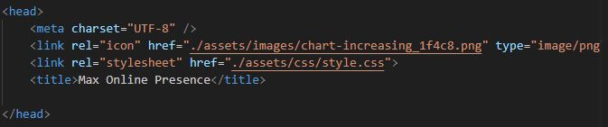
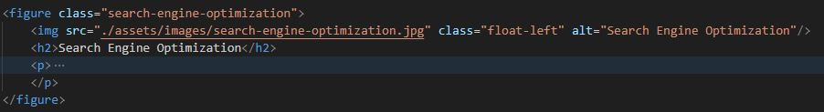

# cautious-robot
01 Challenge Bootcamp

# Description
Review the **HTML** code and get it to meet the Acceptance Criteria by applying the practices learned at the moment in the bootcamp.

## Acceptance Criteria
```
GIVEN a webpage meets accessibility standards
WHEN I view the source code
THEN I find semantic HTML elements
WHEN I view the structure of the HTML elements
THEN I find that the elements follow a logical structure independent of styling and positioning
WHEN I view the icon and image elements
THEN I find accessible alt attributes
WHEN I view the heading attributes
THEN they fall in sequential order
WHEN I view the title element
THEN I find a concise, descriptive title
```

# Screenshots
## CSS snip showing comments

## HTML Title and Icon


## HTML Image Alternative Text

## Web Application Screenshots


# Link
Website Link [Github Pages Link](https://santis1001.github.io/cautious-robot/)
